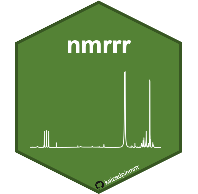

# nmrrr 

<!-- badges: start -->
  

<!-- badges: end -->

A reproducible workflow for binning and visualizing NMR spectra from environmental samples

Install the package using:

`install.packages("nmrrr")`

OR

`remotes::install_github("kaizadp/nmrrr", build_vignettes = TRUE)`

Vignettes can be accessed within R:

`browseVignettes(package = "nmrrr")`

---

### Overview

The `{nmrrr}` package is intended for post-processing of NMR data, 
including importing, merging and, cleaning data from multiple files, 
visualizing NMR spectra, performing binning/integrations for compound classes, 
and relative abundance calculations.   
A strong feature of this package is the ability to batch-process multiple samples, and to do so in a reproducible manner. 

This package can be easily inserted into existing analysis workflows by users 
to help with analyzing and interpreting NMR data. 

Before using this package, NMR spectra must be processed in
[MestreNova](https://mestrelab.com/download/mnova/) or
[TopSpin](https://www.bruker.com/en/products-and-solutions/mr/nmr-software/topspin.html) 
(phase corrected, baseline corrected, deconvoluted, peak picked, normalized).

---- 

### Functions

|                        |                                                                                                              |
|------------------------|--------------------------------------------------------------------------------------------------------------|
| `nmr_import_spectra()` | Import all files from the specified path and generate a single long-form dataframe with all samples.         |
| `nmr_assign_bins()`    | Bin the spectra/assign compound classes based on the preferred bin set. see below for available options.     |
| `nmr_plot_spectra()`   | Plot spectra. If multiple spectra are present, they will be vertically offset.                               |
| `nmr_import_peaks`     | Import and process peaks files generated after peak-picking in MNova.                                        |
| `nmr_relabund()`       | Compute relative abundance of compound classes based on bin assignments.                                     |

----

### Binsets

| Binset name | Solution or solid-state | Target NMR nuclei | Solvent | Citation |
|----|----|-----|----|-----|
| bins_CadeMenun2015 | solution | 31P | D2O + NaOH + EDTA | [Cade-Menun, 2015](https://doi.org/10.1016/j.geoderma.2014.12.016) | 
| bins_Clemente2012 | solution | 1H | DMSO-D6 | [Clemente et al., 2012](https://doi.org/10.1071/EN11096)
| bins_Hertkorn2013 | solution | 1H | MeOD | [Hertkorn et al., 2013](https://doi.org/10.5194/bg-10-1583-2013)
| bins_Lynch2019 | solution | 1H | D2O | [Lynch et al., 2019](https://doi.org/10.1029/2018gb006030)
| bins_Mitchell2018 | solution | 1H | DMSO-D6 | [Mitchell et al., 2018](https://doi.org/10.3390/soils2010008)
| bins_ss_Baldock2004 | solid | 13C | N/A | [Baldock et al., 2004](https://doi.org/10.1016/j.marchem.2004.06.016)
| bins_ss_Clemente2012 | solid | 13C | N/A | [Clemente et al., 2012](https://doi.org/10.1071/EN11096)
| bins_ss_Preston2009 | solid | 13C | N/A | [Preston et al., 2009](https://doi.org/10.1007/s10021-009-9266-0)

Users can choose from the available options, or can import their own preferred bin set. See `vignette("nmrrr")` for more details. 

---

### Contact

We encourage users to provide feedback as [GitHub Issues](https://github.com/kaizadp/nmrrr/issues).  
We also encourage users to submit additional NMR binsets via [GitHub Issues](https://github.com/kaizadp/nmrrr/issues) or [pull requests](https://github.com/kaizadp/nmrrr/pulls), so they can be incorporated into future versions of the package.  

Used this package? Use `citation("nmrrr")` for citation information.

# nmrrr 

<!-- badges: start -->
  

<!-- badges: end -->

A reproducible workflow for binning and visualizing NMR spectra from environmental samples

Install the package using:

`install.packages("nmrrr")`

OR

`remotes::install_github("kaizadp/nmrrr", build_vignettes = TRUE)`

Vignettes can be accessed within R:

`browseVignettes(package = "nmrrr")`

---

### Overview

The `{nmrrr}` package is intended for post-processing of NMR data, 
including importing, merging and, cleaning data from multiple files, 
visualizing NMR spectra, performing binning/integrations for compound classes, 
and relative abundance calculations.   
A strong feature of this package is the ability to batch-process multiple samples, and to do so in a reproducible manner. 

This package can be easily inserted into existing analysis workflows by users 
to help with analyzing and interpreting NMR data. 

Before using this package, NMR spectra must be processed in
[MestreNova](https://mestrelab.com/download/mnova/) or
[TopSpin](https://www.bruker.com/en/products-and-solutions/mr/nmr-software/topspin.html) 
(phase corrected, baseline corrected, deconvoluted, peak picked, normalized).

---- 

### Functions

|                        |                                                                                                              |
|------------------------|--------------------------------------------------------------------------------------------------------------|
| `nmr_import_spectra()` | Import all files from the specified path and generate a single long-form dataframe with all samples.         |
| `nmr_assign_bins()`    | Bin the spectra/assign compound classes based on the preferred bin set. see below for available options.     |
| `nmr_plot_spectra()`   | Plot spectra. If multiple spectra are present, they will be vertically offset.                               |
| `nmr_import_peaks`     | Import and process peaks files generated after peak-picking in MNova.                                        |
| `nmr_relabund()`       | Compute relative abundance of compound classes based on bin assignments.                                     |

----

### Binsets

| Binset name | Solution or solid-state | Target NMR nuclei | Solvent | Citation |
|----|----|-----|----|-----|
| bins_CadeMenun2015 | solution | 31P | D2O + NaOH + EDTA | [Cade-Menun, 2015](https://doi.org/10.1016/j.geoderma.2014.12.016) | 
| bins_Clemente2012 | solution | 1H | DMSO-D6 | [Clemente et al., 2012](https://doi.org/10.1071/EN11096)
| bins_Hertkorn2013 | solution | 1H | MeOD | [Hertkorn et al., 2013](https://doi.org/10.5194/bg-10-1583-2013)
| bins_Lynch2019 | solution | 1H | D2O | [Lynch et al., 2019](https://doi.org/10.1029/2018gb006030)
| bins_Mitchell2018 | solution | 1H | DMSO-D6 | [Mitchell et al., 2018](https://doi.org/10.3390/soils2010008)
| bins_ss_Baldock2004 | solid | 13C | N/A | [Baldock et al., 2004](https://doi.org/10.1016/j.marchem.2004.06.016)
| bins_ss_Clemente2012 | solid | 13C | N/A | [Clemente et al., 2012](https://doi.org/10.1071/EN11096)
| bins_ss_Preston2009 | solid | 13C | N/A | [Preston et al., 2009](https://doi.org/10.1007/s10021-009-9266-0)

Users can choose from the available options, or can import their own preferred bin set. See `vignette("nmrrr")` for more details. 

---

### Contact

We encourage users to provide feedback as [GitHub Issues](https://github.com/kaizadp/nmrrr/issues).  
We also encourage users to submit additional NMR binsets via [GitHub Issues](https://github.com/kaizadp/nmrrr/issues) or [pull requests](https://github.com/kaizadp/nmrrr/pulls), so they can be incorporated into future versions of the package.  

Used this package? Use `citation("nmrrr")` for citation information.

